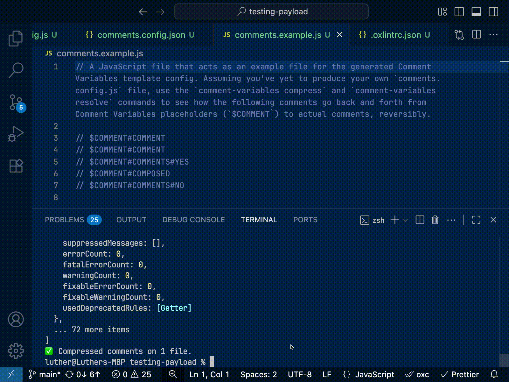

A CLI tool for configuring, managing and maintaining JavaScript comments as JavaScript variables, via a `comments.config.js` file at the root of your project.



## Installation

```
npm install -g comment-variables
```

## Commands

**`comment-variables` (aliases `jscomments`, `comvar`) comes with three commands in this initial release:**

```
comment-variables
```

Interacts with your `comments.config.js` default exported object to print all the parameters you need to be aware of before running `compress` or `resolve`. Also acts as a dry run validation check. If no error is printed, it means you can run `compress` or `resolve` safely, as long the printed parameters correspond to what you've expected from your defined config. (Additionally creates a resolved version of your config data as a JSON file.)

```
comment-variables compress
```

Scans your line and block comments for string values defined in your `comments.config.js` (like `"This is a comment"`) to turn them into their corresponding `$COMMENT#*` tokens defined in your `comments.config.js`. (`This is a comment.` => `$COMMENT#COMMENT`)

```
comment-variables resolve
```

Scans your line and block comments for `$COMMENT#*` tokens (like `$COMMENT#COMMENT`) to turn them into their corresponding string values defined in your `comments.config.js`. (`$COMMENT#COMMENT` => `This is a comment.`)

_The `compress` and `resolve` commands make each other entirely reversible._

**New command: `comment-variables placeholders`**

```
comment-variables placeholders
```

Creates Comment Variables placeholders right next to the single sources of truth where Comment Variables are defined. (See in config example below.)

## Flags

**The CLI tool also comes with three flags initially:**

```
comment-variables --config <your-config.js>
```

Passes a different file as your config instead of the default `comments.config.js` (like `comment-variables --config your-config.js`), through a path relative to the root of your project.

```
--lint-config-imports now part of the config at the `lintConfigImports` key
```

By default, `comment-variables` excludes your config file and all the (JavaScript/TypeScript) files it recursively imports. This flag cancels this mechanism, linting config imports. (The config file however still remains excluded from linting.)

```
--my-ignores-only now part of the config at the `myIgnoresOnly` key
```

By default, `comment-variables` includes a preset list of ignored folders (`"node_modules"`, `".next"`, `".react-router"`...). This flag cancels this mechanism so that you can have full control over your ignored files and folders.

_The --config flag can be composed with any of the commands:_

```
comment-variables --config your-config.js
comment-variables compress --config your-config.js
comment-variables resolve --config your-config.js
comment-variables placeholders --config your-config.js
```

## **`comments.config.js`**

A `comments.config.js` file looks like this. (This is the config file I'm using to manage my JavaScript comments in this library.)

```js
const data = {
  jsDoc: Object.freeze({
    definitions: Object.freeze({
      exitDueToFailure:
        "Terminates the whole process with a 'failure' code (`1`)." /* $COMMENT#JSDOC#DEFINITIONS#EXITDUETOFAILURE */,
      makeRuleResolve:
        "The utility that creates the resolve rule based on the flattened config data, used to transform `$COMMENT` placeholders into actual comments." /* $COMMENT#JSDOC#DEFINITIONS#MAKERULERESOLVE */,
      makeRuleCompress:
        "The utility that creates the compress rule based on the reversed flattened config data, used to transform actual comments into `$COMMENT` placeholders." /* $COMMENT#JSDOC#DEFINITIONS#MAKERULECOMPRESS */,
      coreCommentsFlow:
        "The core flow at the heart of resolving and compressing comments." /* $COMMENT#JSDOC#DEFINITIONS#CORECOMMENTSFLOW */,
      resolveCommentsFlow:
        "The flow that resolves `$COMMENT` placeholders into actual comments." /* $COMMENT#JSDOC#DEFINITIONS#RESOLVECOMMENTSFLOW */,
      compressCommentsFlow:
        "The flow that compresses actual comments into `$COMMENT` placeholders." /* $COMMENT#JSDOC#DEFINITIONS#COMPRESSCOMMENTSFLOW */,
      placeholdersCommentsFlow:
        "The flow that creates `$COMMENT` placeholders right next to where they're defined." /* $COMMENT#JSDOC#DEFINITIONS#PLACEHOLDERSCOMMENTSFLOW */,
      logError:
        'Logs an error to the console depending on its type. (`"error"` or `"warning"`.)' /* $COMMENT#JSDOC#DEFINITIONS#LOGERROR */,
    }),
    params: Object.freeze({
      flattenedConfigData:
        "The flattened config data, with `$COMMENT` placeholders as keys and actual comments as values." /* $COMMENT#JSDOC#PARAMS#FLATTENEDCONFIGDATA */,
      reversedFlattenedConfigData:
        "The reversed flattened config data, with actual comments as keys and `$COMMENT` placeholders as values." /* $COMMENT#JSDOC#PARAMS#REVERSEDFLATTENEDCONFIGDATA */,
      aliases_flattenedKeys:
        "The dictionary that connects aliases to their original flattened keys in case an encountered placeholder is actually an alias." /* $COMMENT#JSDOC#PARAMS#ALIASES_FLATTENEDKEYS */,
      ruleName:
        'The name of the rule currently used. (Either `"resolve"` or `"compress"`.)' /* $COMMENT#JSDOC#PARAMS#RULENAME */,
      ignores:
        "The array of paths and globs for the flow's ESLint instance to ignore." /* $COMMENT#JSDOC#PARAMS#IGNORES */,
      eitherFlattenedConfigData:
        "Either the flattened config data or the reversed flattened config data, since they share the same structure." /* $COMMENT#JSDOC#PARAMS#EITHERFLATTENEDCONFIGDATA */,
      error:
        "The error object being handle for the logging." /* $COMMENT#JSDOC#PARAMS#ERROR */,
      options:
        "The additional options as follows:" /* $COMMENT#JSDOC#PARAMS#OPTIONS */,
      settings:
        "The required settings as follows:" /* $COMMENT#JSDOC#PARAMS#SETTINGS */,
      configPathIgnores:
        'The array of paths linked to the config file, (named "ignores" given it is ignored by the "compress" and "resolve" commands).' /* $COMMENT#JSDOC#PARAMS#CONFIGPATHIGNORES */,
      originalFlattenedConfigData:
        "The original flattened config data, before changes to Aliases Variables and Composed Variables are applied." /* $COMMENT#JSDOC#PARAMS#ORIGINALFLATTENEDCONFIGDATA */,
    }),
    returns: Object.freeze({
      exitDueToFailure:
        "Never. (Somehow typing needs to be explicit for unreachable code inference.)" /* $COMMENT#JSDOC#RETURNS#EXITDUETOFAILURE */,
      makeRuleResolve:
        "The resolve rule based on the flattened config data." /* $COMMENT#JSDOC#RETURNS#MAKERULERESOLVE */,
      makeRuleCompress:
        "The compress rule based on the reversed flattened config data." /* $COMMENT#JSDOC#RETURNS#MAKERULECOMPRESS */,
    }),
  }),
};

const ignores = ["README.md"];

const lintConfigImports = false; // can be ommitted
const myIgnoresOnly = false; // can be ommitted

const config = {
  data,
  ignores,
  lintConfigImports,
  myIgnoresOnly,
};

export default config;
```

And yes, even comments within JavaScript and TypeScript blocks in Markdown files are addressed.

_Leverage the power of JavaScript to programmatically design your JavaScript comments._
